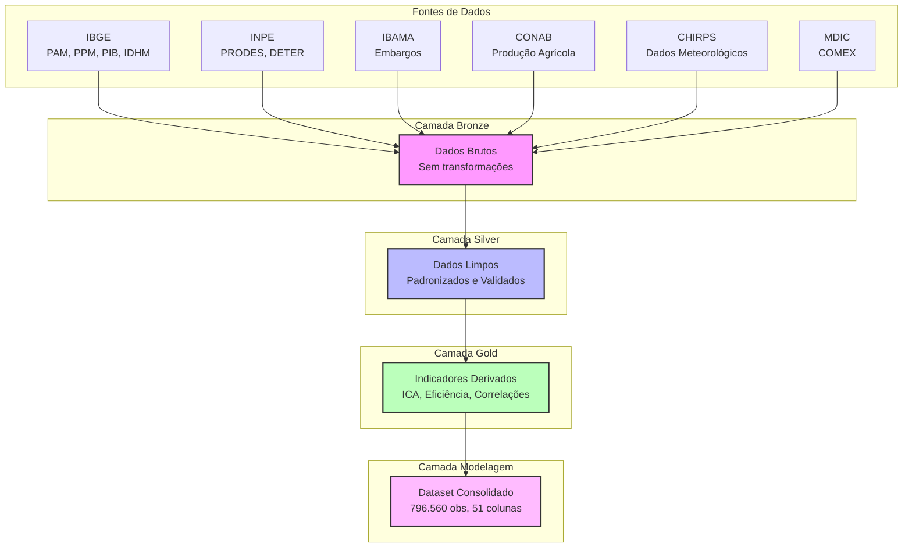
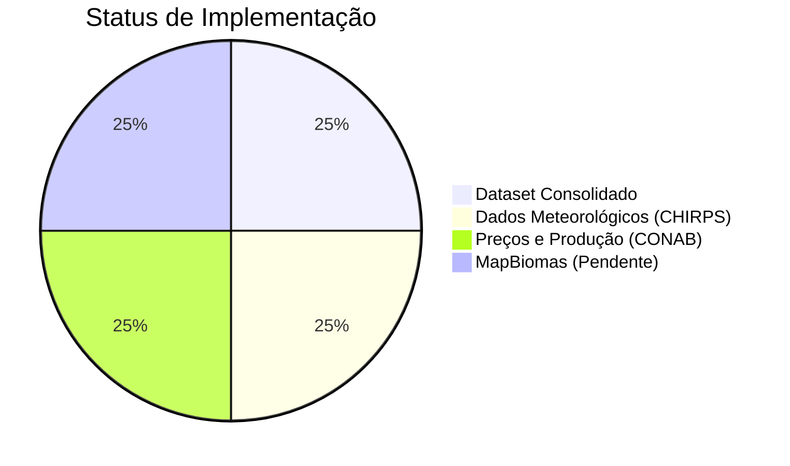
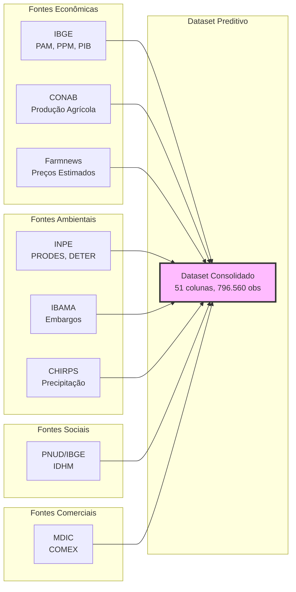

# Análise de Dados de Desmatamento, Atividade Econômica e Impacto Socioambiental na Amazônia Legal

Este projeto analisa a relação entre desmatamento, atividade econômica e impacto socioambiental na Amazônia Legal brasileira, utilizando dados públicos de múltiplas fontes (IBGE, INPE, IBAMA, CONAB, etc.) com arquitetura medallion (Bronze → Silver → Gold) e preparação para modelagem preditiva.

## Objetivos do Projeto

- Analisar correlações entre desmatamento e atividade agropecuária
- Integrar dados econômicos, ambientais, sociais e meteorológicos
- Preparar dataset consolidado para modelagem preditiva
- Desenvolver indicadores de risco e eficiência ambiental
- Avaliar impacto de políticas públicas e incentivos econômicos

## Estrutura do Projeto

```
SABADO-TE-ANALISE-DADOS/
├── data/                          # Dados em diferentes camadas
│   ├── 01_bronze/                # Dados brutos das fontes originais
│   ├── 02_silver/                # Dados limpos e padronizados
│   ├── 03_gold/                  # Dados analíticos e agregados
│   └── 04_modelagem/             # Dataset consolidado para modelagem preditiva
├── src/                          # Scripts de processamento
│   ├── utils/                    # Módulos compartilhados
│   ├── ingestao/                 # Scripts de download de dados
│   ├── transformacao/            # Scripts ETL para camada Silver
│   └── analise/                  # Scripts de análise e visualizações
├── notebooks_exploratorios/      # Notebooks de teste e exploração
├── notebooks_analise_por_eixo/   # Notebooks de análise por eixo temático
├── docs/                         # Documentação técnica
├── logs/                         # Arquivos de log
└── requirements.txt              # Dependências Python
```

## Arquitetura de Dados



## Fluxo de Dados ETL

```mermaid
flowchart LR
    A["Ingestão<br/>Download de Dados"] --> B["Transformação<br/>Limpeza e Padronização"]
    B --> C["Integração<br/>Merge por Código IBGE"]
    C --> D[" Enriquecimento<br/>Features Derivadas"]
    D --> E["Consolidação<br/>Dataset Preditivo"]
    E --> F["Modelagem<br/>ML e Análise Preditiva"]

    style A fill:#ff9,stroke:#333,stroke-width:2px
    style B fill:#9f9,stroke:#333,stroke-width:2px
    style C fill:#99f,stroke:#333,stroke-width:2px
    style D fill:#f9f,stroke:#333,stroke-width:2px
    style E fill:#9ff,stroke:#333,stroke-width:2px
    style F fill:#f99,stroke:#333,stroke-width:2px
```



## Camadas de Dados

### Bronze (01_bronze/)
Dados brutos das fontes originais, sem transformações significativas.

**Fontes de dados:**
- **IBGE**: PAM (produção agrícola), PPM (pecuária), PIB municipal, IDHM
- **INPE**: PRODES (desmatamento anual), DETER (alertas em tempo real)
- **IBAMA**: Embargos ambientais
- **CONAB**: Produção agrícola via agrobr
- **CHIRPS**: Dados meteorológicos sintéticos (precipitação)
- **MDIC**: COMEX (comércio exterior)
- **MapBiomas**: Cobertura e uso da terra (pendente)

### Silver (02_silver/)
Dados limpos, padronizados e integrados. Principais datasets:

**Dados Econômicos:**
- `pam_consolidado.parquet` - Produção Agrícola Municipal (27.505 linhas)
- `pib_vab_consolidado.parquet` - Valor Adicionado Bruto Agropecuário (77.994 linhas)
- `ppm_consolidado.parquet` - Produção da Pecuária Municipal (267.264 linhas)
- `comex_por_uf_ano.parquet` - Comércio Exterior por UF (689 linhas)

**Dados Ambientais:**
- `prodes_consolidado.parquet` - Desmatamento anual por município (432.815 linhas)
- `deter_consolidado.parquet` - Alertas de desmatamento em tempo real (50.454 linhas)
- `embargos_por_municipio_ano.parquet` - Embargos IBAMA (18.355 linhas)

**Dados Meteorológicos:**
- `chirps_amazonia_2020_2023.parquet` - Precipitação sintética CHIRPS (48 observações)

**Dados de Preços e Produção:**
- `*_producao.parquet` - Produção CONAB por UF-safra (soja, milho, trigo, arroz, algodão)
- `estimativas_precos.parquet` - Preços médios anuais (Farmnews)

**Dimensões e Referências:**
- `dim_municipio.parquet` - Dimensão de municípios (5.571 linhas)
- `idhm_municipal_interpolado.parquet` - IDHM municipal interpolado (183.843 linhas)

### Gold (03_gold/)
Dados analíticos com métricas e indicadores calculados:
- `ica_municipal.parquet` - Índice de Compliance Ambiental
- `correlacao_delta.parquet` - Correlação ΔDesmatamento vs ΔVAB
- `densidade_fiscalizacao_municipal.parquet` - Densidade de fiscalização
- `tipologia_municipal_quadrantes.parquet` - Classificação de municípios
- `eficiencia_agricola_pam.parquet` - Eficiência agrícola por hectare
- `eficiencia_ambiental_exportacao.parquet` - Eficiência ambiental de exportações

### Modelagem (04_modelagem/)
Dataset consolidado para modelagem preditiva:
- `dataset_preditivo_com_precos.parquet` - Dataset principal (796.560 linhas, 51 colunas)
- `dataset_preditivo_com_mapbiomas.parquet` - Dataset com MapBiomas (267.360 linhas, 31 colunas)
- `metadados_dataset.json` - Metadados do dataset

**Estrutura do dataset preditivo:**
- Período: 2020-2023
- Cobertura: 5.570 municípios, 27 UFs
- Features: econômicas, ambientais, sociais, meteorológicas, preços agrícolas
- Indicadores derivados: risco_desmatamento, pressao_economica, boom_soja, pressao_agro_alta

## Scripts Principais

### Ingestão
- `src/ingestao/baixar_precos_producao_agricola_paralelo.py` - Download paralelo de preços e produção CONAB
- `src/ingestao/download_cepea_agrobr.py` - Download de dados CEPEA
- `src/ingestao/download_cepea_agrobr_paralelo.py` - Download paralelo CEPEA
- `src/chirps_gee.py` - Geração de dados meteorológicos CHIRPS
- `src/baixar_mapbiomas_estatisticas.py` - Download de estatísticas MapBiomas

### Transformação (Silver)
- `src/transformacao/pam/etl_pam_consolidado.py` - ETL PAM
- `src/transformacao/pib/etl_pib_vab_consolidado.py` - ETL PIB
- `src/transformacao/ppm/etl_ppm_consolidado.py` - ETL PPM
- `src/transformacao/ibama/etl_embargos_municipio_ano.py` - ETL IBAMA
- `src/transformacao/comex/etl_comex_por_uf_ano.py` - ETL COMEX
- `src/transformacao/dimensao/etl_dim_municipio.py` - ETL Dimensão Municípios
- `src/transformacao/deter/etl_deter_consolidado.py` - ETL DETER

### Consolidação e Integração
- `src/transformacao/integrar_precos_producao_dataset.py` - Integração de preços e produção ao dataset
- `src/consolidar_dataset_preditivo.py` - Consolidação do dataset preditivo
- `src/integrar_mapbiomas_dataset_preditivo.py` - Integração MapBiomas ao dataset

### Análise (Gold)
- `src/analise/eficiencia_economica/mvp_economico.py` - Análise de eficiência econômica
- `src/analise/inteligencia_espacial/analise_buffer_spillover.py` - Análise espacial
- `src/analise/cadeia_global/` - Análise de cadeia global
- `src/analise/consolidacao/` - Análises consolidadas

## Instalação e Execução com Docker

Este projeto usa Docker para garantir que rode em qualquer computador sem problemas de dependências.

### Pré-requisitos
- Docker instalado (https://docs.docker.com/get-docker/)
- Docker Compose instalado (https://docs.docker.com/compose/install/)

### Download de Dados (Ingestão)
```bash
docker-compose run app
```

### Scripts de Transformação
```bash
docker-compose run app python src/transformacao/pam/etl_pam_consolidado.py
docker-compose run app python src/transformacao/pib/etl_pib_vab_consolidado.py
docker-compose run app python src/transformacao/ppm/etl_ppm_consolidado.py
docker-compose run app python src/transformacao/ibama/etl_embargos_municipio_ano.py
docker-compose run app python src/transformacao/comex/etl_comex_por_uf_ano.py
docker-compose run app python src/transformacao/dimensao/etl_dim_municipio.py
docker-compose run app python src/transformacao/serie_historica/etl_serie_historica_comum.py
```

### Scripts de Análise
```bash
docker-compose run app python src/analise/eficiencia_economica/mvp_economico.py
```

### Jupyter Notebook (Opcional)
```bash
docker-compose up jupyter
# Acesse em http://localhost:8888
```

### Streamlit (Opcional)
```bash
docker-compose up streamlit
# Acesse em http://localhost:8501
```

### Parar Serviços
```bash
docker-compose down
```

### Método Alternativo: Instalação Local

**Pré-requisitos de Sistema:**
- Python 3.11+
- GDAL, PROJ, GEOS (para geopandas)

**Linux:**
```bash
sudo apt-get update
sudo apt-get install -y python3 python3-pip gdal-bin libgdal-dev libgeos-dev libproj-dev
pip install -r requirements.txt
```

**macOS:**
```bash
brew install python gdal
pip install -r requirements.txt
```

**Windows (Recomendado usar Docker):**
```bash
# Usar conda é mais fácil no Windows
conda create -n analise-dados python=3.11
conda activate analise-dados
conda install -c conda-forge geopandas
pip install -r requirements.txt
```

## Execução Local

### Download de Dados
```bash
python src/ingestao/download_dados_parquet.py
```

### Transformação para Silver
Executar os scripts em ordem na pasta `src/transformacao/`:
1. `pam/etl_pam_consolidado.py`
2. `pib/etl_pib_vab_consolidado.py`
3. `ppm/etl_ppm_consolidado.py`
4. `ibama/etl_embargos_municipio_ano.py`
5. `comex/etl_comex_por_uf_ano.py`
6. `dimensao/etl_dim_municipio.py`
7. `serie_historica/etl_serie_historica_comum.py`

### Análise
```bash
python src/analise/eficiencia_economica/mvp_economico.py
```

## Status Atual



**Concluído:**
- ✓ Dataset consolidado para modelagem (796.560 observações, 51 colunas)
- ✓ Dados meteorológicos integrados (CHIRPS 2020-2023)
- ✓ Preços e produção agrícola integrados (CONAB + Farmnews)
- ✓ Indicadores derivados criados (risco_desmatamento, pressao_economica, boom_soja)
- ✓ Arquitetura medallion implementada (Bronze → Silver → Gold → Modelagem)

**Pendente:**
- ⚠ MapBiomas - dados de cobertura e uso da terra
- ⚠ Modelagem preditiva com ML (fora do escopo atual)

## Documentação

**Planejamento e Análise:**
- `docs/analise_preditiva_planejamento.md` - Planejamento detalhado para modelagem preditiva
- `docs/guia_integracao_dados_externos.md` - Guia técnico de integração de dados externos
- `docs/analise_solucao_precos_dataset.md` - Análise da solução de preços agrícolas

**Implementação:**
- `docs/chirps_implementacao_status.md` - Status da implementação CHIRPS
- `docs/estimativas_precos_historicos.md` - Metodologia de estimativas de preços
- `docs/estrutura_analise.md` - Estrutura da análise
- `docs/plano_implementacao_v2.md` - Plano de implementação atualizado
- `docs/resumo_transformacoes_dados.md` - Resumo das transformações de dados

## Integração de Fontes de Dados



## Dependências Principais

**Manipulação de Dados:**
- pandas - Manipulação de dados
- pyarrow - Formato Parquet
- duckdb - Consultas analíticas performáticas

**Fontes de Dados:**
- sidrapy - API do IBGE SIDRA
- agrobr - API CONAB e CEPEA

**Dados Geoespaciais:**
- geopandas - Dados geoespaciais
- shapely - Operações geométricas

**Visualizações:**
- matplotlib/seaborn - Visualizações
- plotly - Visualizações interativas

**Machine Learning:**
- scikit-learn - Machine learning
- statsmodels - Análise estatística
- xgboost - Gradient boosting

**Processamento Paralelo:**
- asyncio - Downloads assíncronos
- concurrent.futures - Processamento paralelo

## Licença

Este projeto é um projeto acadêmico para análise de dados públicos.
