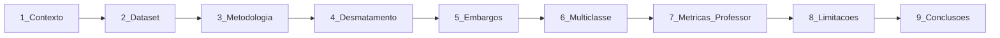

# Roteiro de Apresentação — Modelagem de Classificação

**Duração sugerida:** 12–15 minutos (~9 slides)  
**Público:** professor / banca (disciplina Tópicos Especiais — notebooks 17, 18 e 19)  
**Material de apoio:** [`relatorio_modelagem_classificacao.md`](relatorio_modelagem_classificacao.md)

---

## Fluxo da apresentação



---

## Slide 1 — Contexto do projeto

**Conteúdo na tela**
- Título: *Modelagem preditiva na Amazônia Legal*
- Objetivo: prever desmatamento, embargos e risco municipal no **ano seguinte**
- Fontes integradas: PRODES/DETER, IBAMA, IBGE, CHIRPS, preços agrícolas
- Arquitetura: Bronze → Silver → Gold → **04_modelagem**

**Notas do apresentador**
- Contextualize o projeto como pipeline ETL completo, não só ML.
- Enfatize a pergunta de negócio: *quais municípios merecem monitoramento preventivo no próximo ano?*
- Mencione que a modelagem usa o dataset `dataset_preditivo_com_precos.parquet`.

**Pergunta esperada:** *Por que prever o ano seguinte e não o ano corrente?*  
**Resposta:** O target é criado com `shift(-1)` — usamos informações do ano *t* para prever o desfecho em *t+1*, evitando usar o próprio desfecho como feature (vazamento).

---

## Slide 2 — Dataset e preparação

**Conteúdo na tela**
- Arquivo: `data/04_modelagem/dataset_preditivo_com_precos.parquet`
- 796.560 linhas brutas → **22.280** após deduplicação (`cod_ibge` + `ano`)
- 41 features numéricas + 3 categóricas (UF, região, IDHM)
- Três targets: binário desmatamento, binário embargos, multiclasse risco

**Notas do apresentador**
- Explique a deduplicação: o parquet tinha duplicatas por município/ano; mantivemos a última observação.
- Destaque o desbalanceamento: ~99,5% sem desmatamento no treino; embargos ~90%/10%.
- Treino: 11.140 obs (2020–2021); teste: 5.570 obs (2022).

**Pergunta esperada:** *Por que tantas linhas viraram 22 mil?*  
**Resposta:** Duplicatas no painel; após `drop_duplicates` por município e ano, restam ~5.570 municípios × 4 anos.

---

## Slide 3 — Metodologia

**Conteúdo na tela**
- Target temporal: `groupby(cod_ibge).shift(-1)`
- Split temporal: **treino 2020–2021**, **teste 2022** (prevê 2023)
- 2023 não entra no teste (não há target de 2024)
- Modelos: Dummy, Árvore, KNN, Random Forest
- Balanceamento no treino: nenhum, SMOTE, NearMiss
- Validação cruzada estratificada (F1 weighted)

**Notas do apresentador**
- Alinhe com notebook 18: train/test split, baseline, métricas.
- Explique que SMOTE/NearMiss **só** alteram o treino — teste permanece real.
- Amostragem estratificada (máx. 50.000) existe no código, mas não foi necessária neste run.

**Pergunta esperada:** *Por que split temporal e não aleatório?*  
**Resposta:** Simula uso real: treinar no passado, avaliar em ano futuro não visto. Split aleatório inflaria métricas por vazamento temporal.

---

## Slide 4 — Desmatamento (binário)

**Conteúdo na tela**
- Melhor F1 weighted: **KNN (nenhuma)** — 0,9918
- Recall classe 1: **30%** | ROC-AUC: **0,76**
- Baseline Dummy: F1 weighted 0,99, recall classe 1 = **0%**
- Figuras: matriz de confusão e curva ROC do KNN

**Caminhos das figuras**
- `data/04_modelagem/resultados_metricas/matriz_confusao_kneighborsclassifier_(nenhuma).png`
- `data/04_modelagem/resultados_metricas/curva_roc_kneighborsclassifier_(nenhuma).png`

**Notas do apresentador**
- **Mensagem central:** F1 alto é enganoso — 99,5% dos casos são classe 0.
- Compare explicitamente com Dummy: ganho real está no recall da classe positiva (0 → 30%).
- ROC-AUC 0,76 > 0,50 (baseline), mas ainda modesto para produção.
- NearMiss destruiu performance (accuracy ~49%) — não usar com classe raríssima.

**Pergunta esperada:** *Random Forest com SMOTE teve ROC-AUC 0,93 — por que não escolher RF?*  
**Resposta:** RF+SMOTE discrimina melhor (ROC-AUC), mas KNN lidera F1 weighted neste critério de seleção. Para fiscalização, RF+SMOTE pode ser preferível se priorizarmos ROC-AUC e recall — trade-off a discutir com o negócio.

---

## Slide 5 — Embargos (binário)

**Conteúdo na tela**
- Melhor: **Random Forest + SMOTE** — F1 0,8739, ROC-AUC 0,87
- Recall classe 1: ~41% | Precision classe 1: ~56%
- Desbalanceamento moderado (~10% positivos)
- Figuras: matriz e ROC do RF+SMOTE

**Caminhos das figuras**
- `data/04_modelagem/resultados_metricas/matriz_confusao_randomforestclassifier_(smote).png`
- `data/04_modelagem/resultados_metricas/curva_roc_randomforestclassifier_(smote).png`

**Notas do apresentador**
- Este é o problema **mais equilibrado** — SMOTE ajudou de fato.
- Mostre matriz: ~293 embargos detectados de 722 reais (recall ~41%).
- Conecte com IBAMA: modelo apoia priorização, não substitui fiscalização.

**Pergunta esperada:** *SMOTE não inventa dados demais?*  
**Resposta:** Sim, sintetiza exemplos minoritários — por isso aplicamos só no treino e validamos em teste real de 2022. Resultado foi melhor que baseline, mas deve ser monitorado.

---

## Slide 6 — Risco multiclasse

**Conteúdo na tela**
- Classes: **baixo** (sem desmatamento), **medio**, **alto** (por mediana da área desmatada)
- Melhor F1 weighted: RF + SMOTE — 0,9897
- F1 macro: ~0,48 | Classe **medio**: recall 0%
- Apenas ~46 positivos no teste (23 medio + 23 alto)

**Notas do apresentador**
- Alinhe com notebook 19: problema multiclasse, matriz de confusão por classe.
- F1 weighted ~0,99 esconde falha total na classe medio.
- Conclusão honesta: com 4 anos de dados, granularidade alto/medio/baixo não é viável.

**Pergunta esperada:** *Por que não usar só binário?*  
**Resposta:** Tentamos multiclasse para priorização fina (políticas diferenciadas). Os resultados mostram que binário ou duas classes (sem desmatamento vs. com) seria mais robusto.

---

## Slide 7 — Alinhamento com os notebooks do professor

**Conteúdo na tela**

| Notebook | Tópico | O que aplicamos |
|----------|--------|-----------------|
| **17** — Classificação | Algoritmos supervisionados | Dummy, Árvore, KNN, Random Forest |
| **18** — Validação e métricas | Split, baseline, matriz, ROC, CV | Split temporal, DummyClassifier, ROC-AUC, validação cruzada |
| **19** — Multiclasse | Mais de duas classes | `classe_risco_proximo_ano` (baixo/medio/alto) |

**Notas do apresentador**
- Demonstre que seguimos a progressão pedagógica: modelos → avaliação → multiclasse.
- Cite `classification_report`, matriz de confusão e curva ROC como no notebook 18.
- Mencione `imbalanced-learn` (SMOTE/NearMiss) como extensão além dos notebooks.

---

## Slide 8 — Limitações

**Conteúdo na tela**
- Poucos anos (2020–2023) → poucas classes raras no teste
- Desbalanceamento extremo em desmatamento
- CHIRPS: cobertura incompleta em alguns municípios
- MapBiomas ainda parcialmente integrado
- Split temporal impede CV temporal robusta

**Notas do apresentador**
- Seja transparente: métricas altas ≠ modelo pronto para produção.
- NearMiss piorou resultados — técnica inadequada para classe <1%.
- Próximos passos: mais anos, features espaciais, threshold tuning para recall.

---

## Slide 9 — Conclusões

**Conteúdo na tela**

| Problema | Funcionou | Não funcionou |
|----------|-----------|---------------|
| Desmatamento | ROC-AUC acima do baseline | F1 weighted enganoso; recall baixo |
| Embargos | RF+SMOTE equilibrado | Ainda ~60% de falsos negativos |
| Multiclasse | Detecta classe baixo | Classes medio/alto praticamente ignoradas |

**Próximos passos**
1. Incorporar mais anos e MapBiomas completo
2. Otimizar threshold para recall (custo de falsos negativos)
3. Avaliar modelos espaciais / painel longitudinal

**Notas do apresentador**
- Feche com mensagem: *pipeline ETL + ML com interpretação honesta*.
- Indique relatório completo em `docs/relatorio_modelagem_classificacao.md`.
- Artefatos reproduzíveis via scripts em `src/modelagem/`.

**Pergunta esperada:** *O modelo está pronto para uso pelo IBAMA?*  
**Resposta:** Não em produção. É prova de conceito acadêmica com limitações de dados; embargos é o caso mais promissor; desmatamento precisa de mais dados e métricas orientadas a recall.

---

## Checklist antes de apresentar

- [ ] Abrir matriz de confusão e ROC do KNN (desmatamento)
- [ ] Abrir matriz e ROC do RF+SMOTE (embargos)
- [ ] Ter tabela resumo executiva do relatório visível
- [ ] Testar projeção das figuras PNG
- [ ] Revisar comandos de reprodução (`treinar_*.py`, `gerar_relatorio_modelagem.py`)

---

## Comandos para reproduzir resultados

```bash
source .venv/bin/activate
python src/modelagem/treinar_classificacao_binaria.py --target tem_desmatamento_proximo_ano
python src/modelagem/treinar_classificacao_binaria.py --target tem_embargos_proximo_ano
python src/modelagem/treinar_classificacao_multiclasse.py
python src/modelagem/gerar_relatorio_modelagem.py
```
